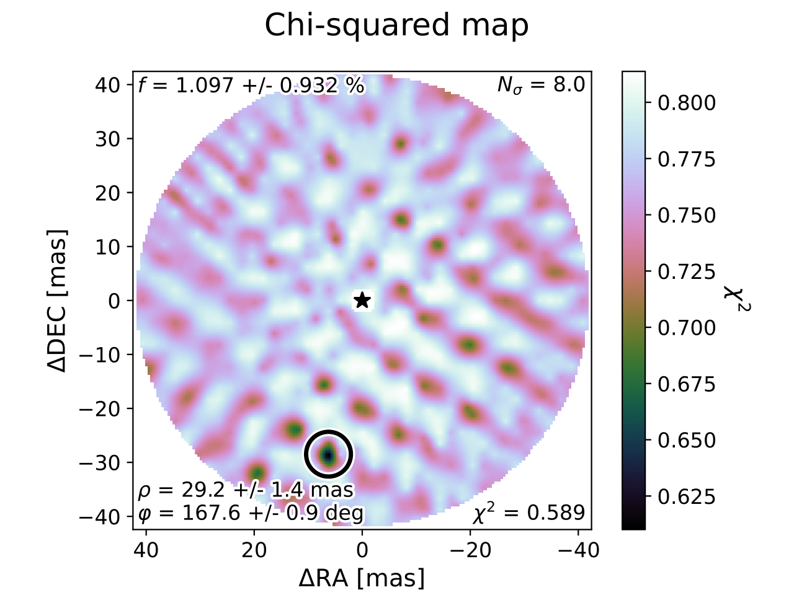
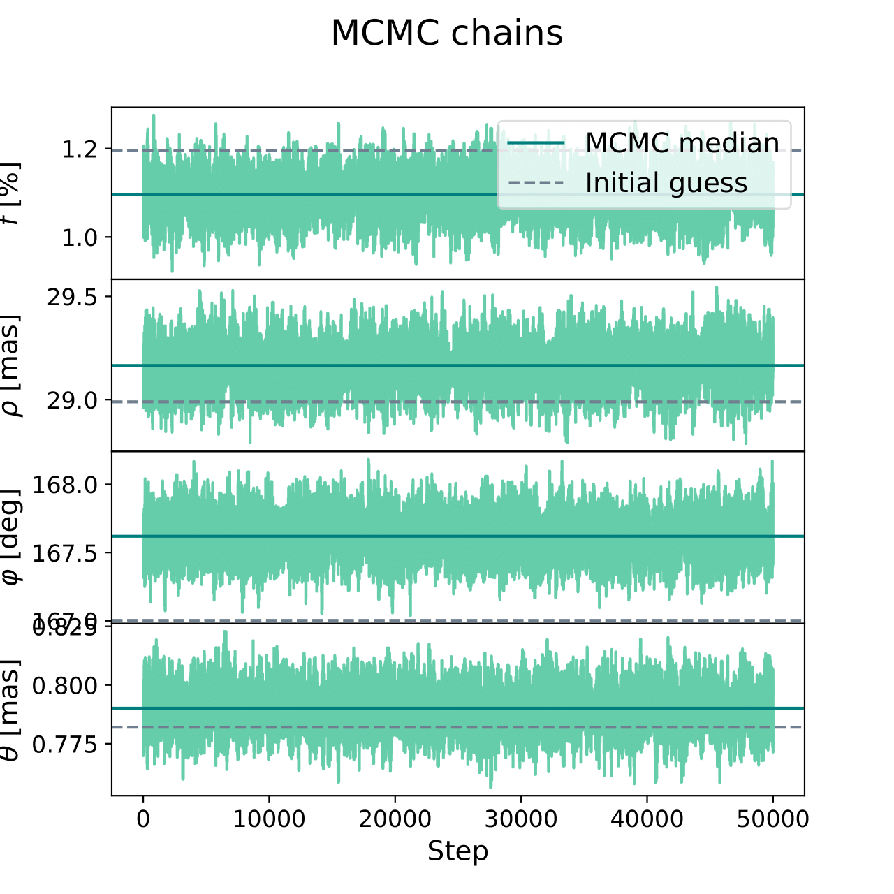
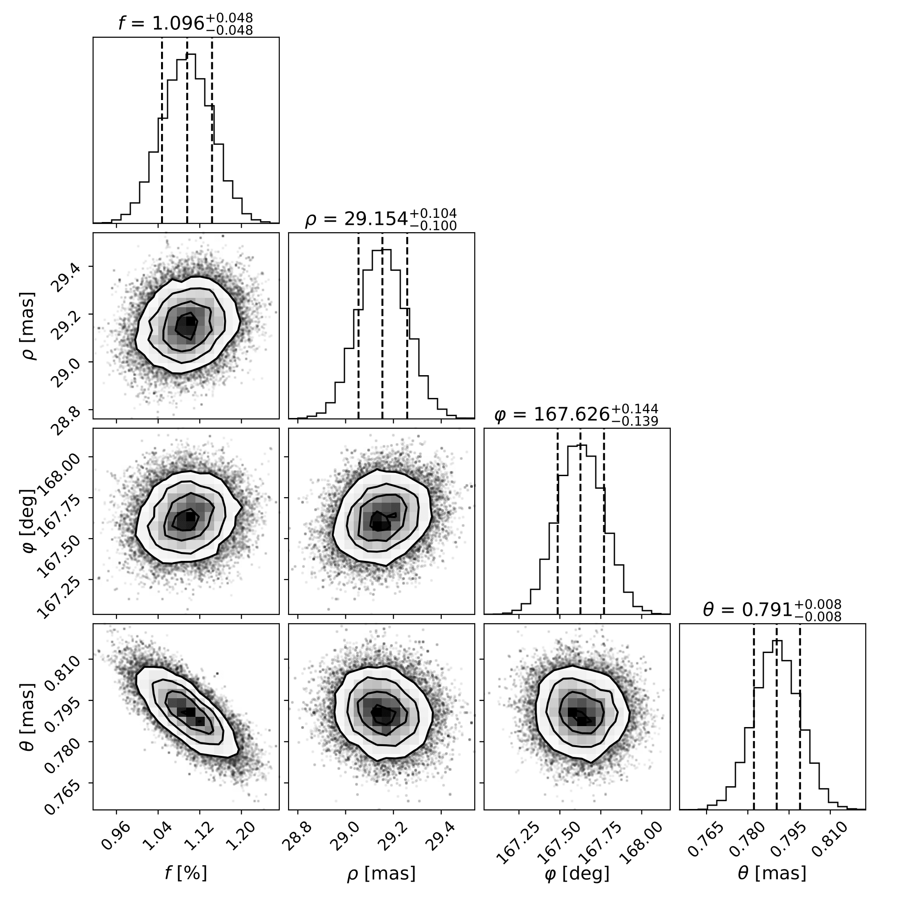
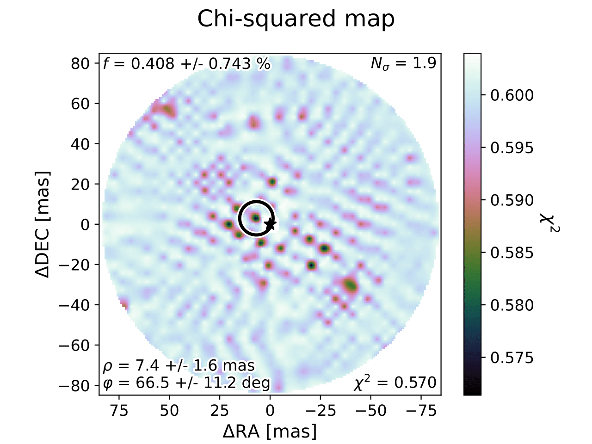
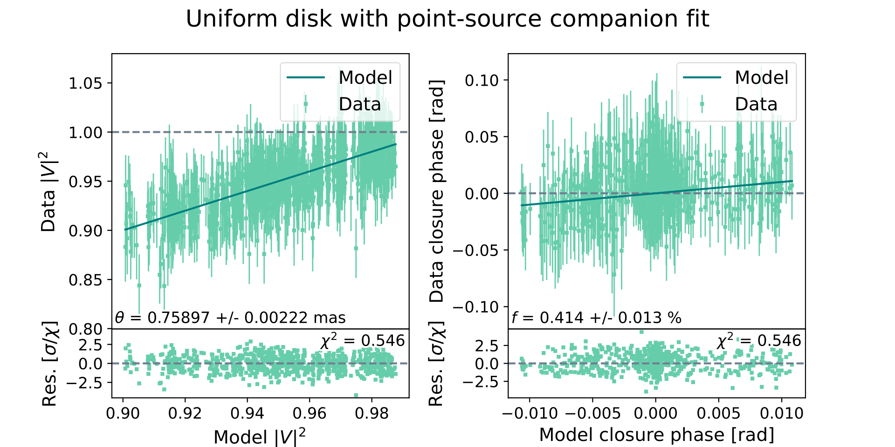
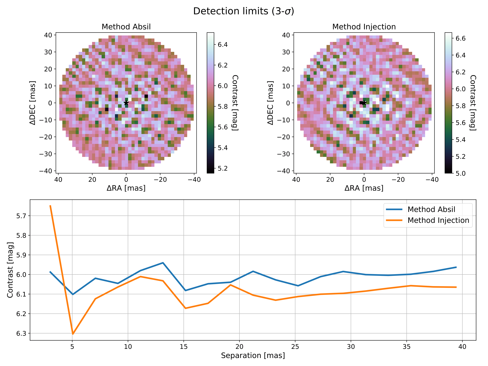

# fouriever

A single toolkit for calibrations, correlations, and companion search for kernel phase, aperture masking, and long-baseline interferometry data.

## Description

This toolkit combines different pieces of code that I developed mainly during my PhD. The major ideas come from [CANDID](https://github.com/amerand/CANDID) and [pynrm](https://github.com/mikeireland/pynrm). Collaborators include **Antoine Merand**, **Mike Ireland**, **Frantz Martinache**, **Tomas Stolker**, and **Thomas Vandal**. The ultimate purpose is a common framework to analyze and fit kernel phase, aperture masking, and long-baseline interferometry data. At the moment, a major focus lies on JWST/NIRCam & JWST/NIRISS kernel phase and JWST/NIRISS aperture masking interferometry.

Currently, the toolkit contains the following functionalities:

* Companion detection maps based on a linearized binary model including the possibility to account for correlations. Published in [Kammerer et al. 2019](https://ui.adsabs.harvard.edu/abs/2019MNRAS.486..639K/abstract).
* Chi-squared detection maps similar to the fitMaps in [CANDID](https://github.com/amerand/CANDID), but including the possibility to account for correlations. Published in [Kammerer et al. 2020](https://ui.adsabs.harvard.edu/abs/2020A%26A...644A.110K/abstract) and [Kammerer et al. 2021a](https://ui.adsabs.harvard.edu/abs/2021A%26A...646A..36K/abstract).
* Numerically computed bandwidth smearing as in [CANDID](https://github.com/amerand/CANDID).
* Possibility to define a search region for the companion.
* [MCMC](https://ui.adsabs.harvard.edu/abs/2013PASP..125..306F/abstract) to nail down the companion parameters and estimate their uncertainties. Published in [Kammerer et al. 2021a](https://ui.adsabs.harvard.edu/abs/2021A%26A...646A..36K/abstract).
* Karhunen-Loeve calibration for kernel phase and OIFITS files. Published in [Kammerer et al. 2019](https://ui.adsabs.harvard.edu/abs/2019MNRAS.486..639K/abstract).
* Modeling of aperture masking and long-baseline interferometry correlations. Published in [Kammerer et al. 2020](https://ui.adsabs.harvard.edu/abs/2020A%26A...644A.110K/abstract).
* Estimation of detection limits as in [CANDID](https://github.com/amerand/CANDID).

Future updates will include:

* Reconstruction of saturated PSFs. Published in [Kammerer et al. 2019](https://ui.adsabs.harvard.edu/abs/2019MNRAS.486..639K/abstract).
* Modeling of kernel phase correlations. Published in [Kammerer et al. 2019](https://ui.adsabs.harvard.edu/abs/2019MNRAS.486..639K/abstract).

## Tutorials

There are several tutorials and test data sets provided that can be used to test and explore the functionalities of the fouriever toolkit. We note that the toolkit does currently understand OIFITS files and [kernel phase FITS files](http://frantzmartinache.eu/xara_doc/03_kernel_fits.html). The following test data sets are provided:
* JWST/NIRISS AMI of AB Dor (simulated).
* VLTI/PIONIER of AX Cir (on-sky).
* VLTI/GRAVITY of beta Pic (simulated).
* VLT/NACO kernel phase of HIP 50156 (on-sky).
* Keck/NIRC2 kernel phase of V410 Tau (on-sky).

## Examples

AX Cir, with correlations and bandwidth smearing.

```
Opened PIONIER_Pnat(1.6135391/1.7698610) data
   50 observations
   6 baselines
   4 triangles
   3 wavelengths
Selected instrument = PIONIER_Pnat(1.6135391/1.7698610)
   Use self.set_inst(inst) to change the selected instrument
Selected observables = ['v2', 'cp']
   Use self.set_observables(observables) to change the selected observables
```

Chi-squared map and model vs. data plot:

```
Data properties
   Smallest spatial scale = 2.0 mas
   Bandwidth smearing FOV = 34.9 mas
   Diffraction FOV = 221.9 mas
   Largest spatial scale = 34.9 mas
   Bandwidth smearing = 3
   Using data covariance = True
   WARNING: covariance matrix does not have full rank
Computing best fit uniform disk diameter (DO NOT TRUST UNCERTAINTIES)
   Best fit uniform disk diameter = 0.93084 +/- 0.00048 mas
   Best fit red. chi2 = 0.811 (ud)
Computing grid
   Min. sep. = 2.0 mas
   Max. sep. = 41.7 mas
   1352 non-empty grid cells
Computing chi-squared map (DO NOT TRUST UNCERTAINTIES)
   Cell 1849 of 1849
   1121 unique minima found after 1352 fits
   Optimal step size = 2.0 mas
   Current step size = 2.0 mas
   Best fit companion flux = 0.937 +/- 0.053 %
   Best fit companion right ascension = 6.3 +/- 0.1 mas
   Best fit companion declination = -28.5 +/- 0.1 mas
   Best fit companion separation = 29.2 +/- 0.1 mas
   Best fit companion position angle = 167.6 +/- 0.1 deg
   Best fit uniform disk diameter = 0.81562 +/- 0.00776 mas
   Best fit red. chi2 = 0.589 (ud+bin)
   Significance of companion = 8.0 sigma
```




MCMC chains and posterior:

```
Computing best fit uniform disk and companion parameters (UNCERTAINTIES FROM MCMC)
   Bandwidth smearing = 3
   Using data covariance = True
   WARNING: covariance matrix does not have full rank
   Covariance inflation factor = 0.589
   This may take a few minutes
100%|███████████████████████████████████████| 5000/5000 [03:05<00:00, 27.01it/s]
   Best fit companion flux = 0.934 +/- 0.040 %
   Best fit companion right ascension = 6.2 +/- 0.1 mas
   Best fit companion declination = -28.5 +/- 0.1 mas
   Best fit companion separation = 29.2 +/- 0.1 mas
   Best fit companion position angle = 167.7 +/- 0.1 deg
   Best fit uniform disk diameter = 0.81599 +/- 0.00734 mas
   Best fit red. chi2 = 0.589 (ud+bin)
   Significance of companion = 8.0 sigma
```




Chi-squared map and model vs. data plot of residuals:

```
Subtracting ud_bin model
Data properties
   Smallest spatial scale = 2.0 mas
   Bandwidth smearing FOV = 34.9 mas
   Diffraction FOV = 221.9 mas
   Largest spatial scale = 34.9 mas
   Bandwidth smearing = 3
   Using data covariance = True
   WARNING: covariance matrix does not have full rank
Computing best fit uniform disk diameter (DO NOT TRUST UNCERTAINTIES)
   Best fit uniform disk diameter = 0.81601 +/- 0.00046 mas
   Best fit red. chi2 = 0.589 (ud)
Computing grid
   Min. sep. = 2.0 mas
   Max. sep. = 41.7 mas
   1352 non-empty grid cells
Computing chi-squared map (DO NOT TRUST UNCERTAINTIES)
   Cell 1849 of 1849
   1283 unique minima found after 1352 fits
   Optimal step size = 2.0 mas
   Current step size = 2.0 mas
   Best fit companion flux = 0.414 +/- 0.013 %
   Best fit companion right ascension = -20.1 +/- 0.3 mas
   Best fit companion declination = -20.5 +/- 0.3 mas
   Best fit companion separation = 28.7 +/- 0.3 mas
   Best fit companion position angle = -135.4 +/- 0.6 deg
   Best fit uniform disk diameter = 0.75897 +/- 0.00222 mas
   Best fit red. chi2 = 0.546 (ud+bin)
   Significance of companion = 2.4 sigma
```




Detection limits of residuals using Absil and Injection method:

```
Subtracting ud_bin model
Data properties
   Smallest spatial scale = 2.0 mas
   Bandwidth smearing FOV = 34.9 mas
   Diffraction FOV = 221.9 mas
   Largest spatial scale = 34.9 mas
   Bandwidth smearing = 3
   Using data covariance = True
   WARNING: covariance matrix does not have full rank
Computing best fit uniform disk diameter (DO NOT TRUST UNCERTAINTIES)
   Best fit uniform disk diameter = 0.81601 +/- 0.00046 mas
   Best fit red. chi2 = 0.589 (ud)
Computing grid
   Min. sep. = 2.0 mas
   Max. sep. = 41.7 mas
   1352 non-empty grid cells
Computing detection limits (3-sigma)
   Cell 1849 of 1849
```

